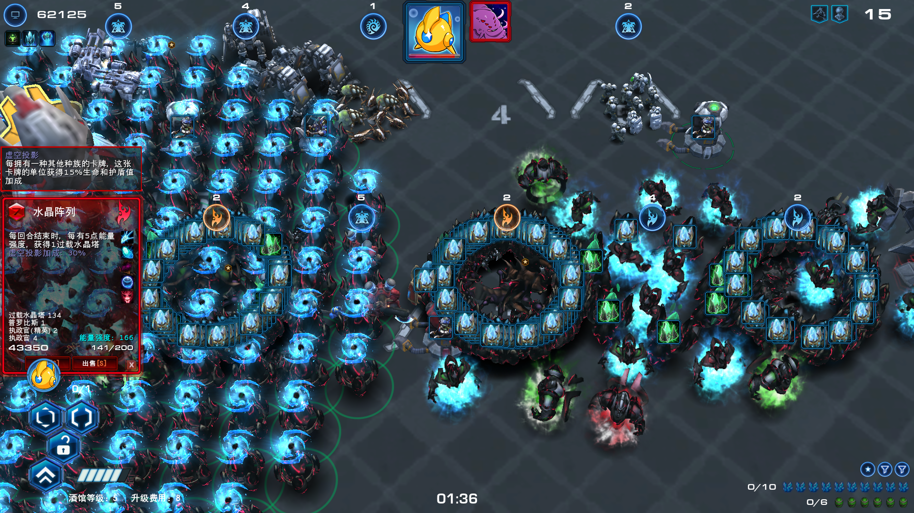
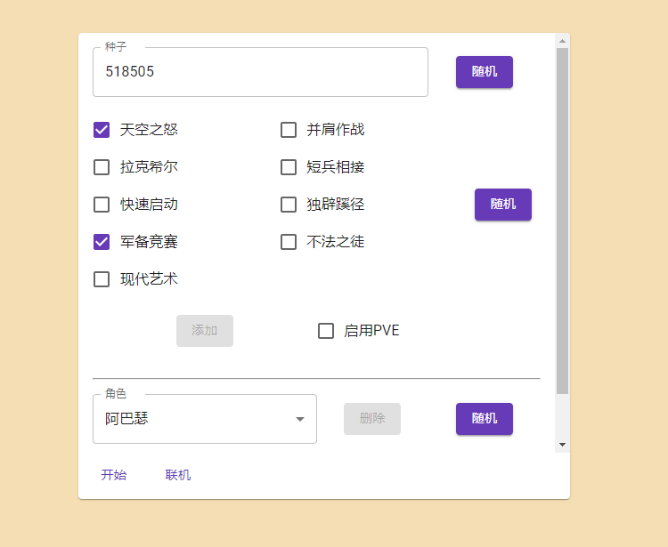
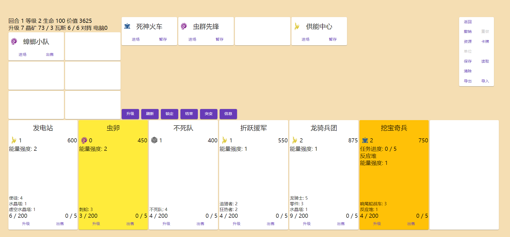

[TOC]

# 星际酒馆模拟器

### 部署在[GithubPage](https://neko-para.github.io/sctavern/)

> 该页面不支持联机

### 原始游戏图片



### 模拟器图片(PC)





## 数据

存放游戏核心的数据信息

### 单位

```typescript
type UnitType = 'normal' | 'special unit' | 'special structure'

const enum UnitTag {
  Light = 'light', // 轻甲
  Armored = 'armored', // 重甲
  Biological = 'biological', // 生物
  Mechanical = 'mechanical', // 机械
  Massive = 'massive', // 重型
  Heroic = 'heroic', // 英雄
  Structure = 'structure', // 建筑
  Psionic = 'psionic', // 灵能
  Summoned = 'summoned', // 召唤
  Air = 'air', // 空中单位
}

interface Unit {
  name: UnitKey
  pinyin: string
  race: Race
  value: number

  type: UnitType
  tag: {
    [tag in UnitTag]?: true
  }

  health: number
  shield?: number
}

type UnitKey = /* ... */
```

* `UnitKey`
  * `type`
    * 判断是否为特殊单位和建筑, 例如`反应堆`(特殊建筑)和`精华`(特殊单位), 实际上由于只会判断是否为普通单位, 可以考虑把特殊建筑和特殊单位合而为一.

  * `tag`
    * 词条以及是否为空军(用于`星港`). 词条实际上只用了生物, 机械, 重型, 英雄, 建筑, 另外几个目前没有实际用途.

  * `health`, `shield`
    * 献祭时需要该数据


```typescript
export const AllUnit: readonly UnitKey[]
export const PvpPresetActiveUnit: readonly UnitKey[]
export const PvePresetActiveUnit: readonly UnitKey[]
export const UnitData: {
    [key in UnitKey]: Unit & { name: key }
}
```

* `PvpPresetActiveUnit`, `PvePresetActiveUnit`

  * PVP/PVE模式启用的单位, 用于判定精英化和皇家单位以及限制作弊模式下能够获得的单位

  > 例如, PVP模式没有`守卫(精英)`, 无法通过`适者生存`将`守卫`精英化, 但是在PVE模式中包含该单位, 因此可以精英化


### 卡牌

```typescript
type CardBelong = 'none' | 'primal' | 'virtual'

type CardType = 'normal' | 'structure' | 'support'

interface Card {
  name: CardKey
  pinyin: string
  race: Race
  level: number
  pack: PackKey
  unit: {
    [key in UnitKey]?: number
  }
  attr: {
    amber?: true
    gold?: true
    insert?: true
  }
  belong: CardBelong
  type: CardType

  desc: [string, string][]
}

type CardKey = /* ... */
```

* `Card`
  * `attr`
    * `amber`
      * 无法三连

    * `gold`
      * 金色卡牌. 部分金色衍生卡的属性, 如`虫卵`, `刀锋女王`.

    * `insert`
      * 定点部署

  * `belong`
    * `primal`
      * 属于`原始虫群`

    * `virtual`
      * 属于`虚影`, 即可以点出`虚空能量`的若干张卡所属的集合

  * `type`
    * `structure`
      * 建筑卡

    * `support`
      * 辅助卡

  * `desc`
    * 卡牌默认的描述词条, 每个词条直接存储普通和金色两个版本的文字


```typescript
export const AllCard: readonly CardKey[]
export const CardData: {
  [key in CardKey]: Card & { name: key }
}
```

### 卡牌包

```typescript
type PackKey = /* ... */
```

```typescript
export const PackData: Record<PackKey, CardKey[]>
export const ExtPack: PackKey[]
export const PresetPoolPack: PackKey[]
export const PvpPresetActivePack: PackKey[]
export const PvePresetActivePack: PackKey[]
```

* `PackData`
  * 每个卡牌包包含的卡牌
* `ExtPack`
  * 所有扩展包的名称
* `PresetPoolPack`
  * 所有允许进入卡池的卡牌包
* `PvpPresetActivePack`, `PvePresetActivePack`
  * PVP/PVE模式启用的卡牌包, 主要用于限制作弊模式下能够获得的卡牌

### 升级

```typescript
type UpgradeCategory =
  | 'special' // 特殊
  | 'combine' // 三连
  | 'terran'
  | 'zerg'
  | 'protoss'
  | 'public' // 公共
  | 'virtual' // 虚影
  | 'primal' // 中立

interface Upgrade {
  name: UpgradeKey
  pinyin: string
  override: boolean
  category: UpgradeCategory
}

type UpgradeKey = /* ... */
```

* `Upgrade`
  * `override`
    * 是否不唯一
  * `category`
    * 所属分类

```typescript
export AllUpgrade: readonly UpgradeKey[]
export UpgradeData: {
    [key in UpgradeKey]: Upgrade & { name: key }
}
```

### 角色

```typescript
interface Role {
  name: RoleKey
  pinyin: string
  ability: string
  desc: string
  ext?: true
}

type RoleKey = /* ... */
```

* `Role`
  * `ability`
    * 角色技能名称
  * `desc`
    * 角色技能效果
  * `ext`
    * 是否为衍生角色, 如`凯瑞甘(异虫形态)`, `解放者(防卫模式)`

```typescript
export const AllRole: readonly RoleKey[]
export const RoleData: {
    [key in RoleKey]: Role & { name: key }
}
```

### 突变

```typescript
interface Mutation {
  name: MutationKey
  pinyin: string
  prevent?: RoleKey
}

type MutationKey = /* ... */
```

* `Mutation`
  * `prevent`
    * 启用突变时禁用的角色

```typescript
export const AllMutation: readonly MutationKey[]
export const MutationData: {
  [key in MutationKey]: Mutation & { name: key }
}
```

### 预言(PVE)

```typescript
interface Prophesy {
  name: ProphesyKey
  pinyin: string
  type: RoleKey | 0 | 1 | 2
  desc: string
  unique?: true
}

type ProphesyKey = /* ... */
```

* `Prophesy`
  * `type`
    * 预言所属类型, 即角色预言, 初级预言, 中级预言, 终极预言
  * `desc`
    * 预言效果描述
  * `unique`
    * 是否唯一(通过高级预言`废弃试验品`可以获得额外的中级预言)

### 埃蒙部队(PVE)

> 目前这部分数据还在开发中, 不稳定

```typescript
export const Amon: {
  [key in string]?: {
    units: UnitKey[]
  }
}
```
